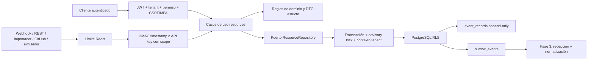

# Arquitectura de activos y conectores

## Modelo

- `assets`: aplicación, servidor, API, base de datos, repositorio u otro; incluye criticidad,
  responsable, etiquetas, estado y versión.
- `asset_dependencies`: aristas dirigidas y tipadas entre dos activos del mismo tenant.
- `connectors`: definición de webhook, REST, importación JSON/CSV, GitHub o simulador. La
  configuración es explícitamente no secreta.
- `webhook_secrets`: versiones cifradas y rotables con periodo de gracia.
- `api_keys`: prefijo visible, HMAC del token, scopes, expiración, último uso y revocación.
- `idempotency_records`: hash de clave/solicitud, estado y respuesta de replay cifrada cuando
  contiene material sensible.

## Fronteras de seguridad

1. Los guards rechazan un `organizationId` distinto del principal; RLS vuelve a comprobarlo en la
   base incluso si una consulta omite el filtro.
2. Las dependencias y credenciales usan claves foráneas compuestas con `organization_id`, de modo
   que PostgreSQL impide aristas o conectores cruzados.
3. Listar conectores nunca carga secretos y listar API keys expone solo metadatos/prefijo.
4. La rotación y emisión devuelven el secreto una vez. El log global redacta cookies,
   autorización, CSRF y `X-API-Key`.
5. El endpoint público recibe máximo 1 MiB y almacena únicamente una huella SHA-256 y metadatos de
   recibo. No interpreta contenido durante esta fase.

## Matriz de permisos añadida

| Permiso                   | Owner | Admin | Analyst | Viewer |
| ------------------------- | :---: | :---: | :-----: | :----: |
| `asset.read`              |   ✓   |   ✓   |    ✓    |   ✓    |
| `asset.manage`            |   ✓   |   ✓   |    ✓    |        |
| `connector.read`          |   ✓   |   ✓   |    ✓    |   ✓    |
| `connector.manage`        |   ✓   |   ✓   |         |        |
| `connector.secret.rotate` |   ✓   |   ✓   |         |        |
| `api-key.read`            |   ✓   |   ✓   |         |        |
| `api-key.manage`          |   ✓   |   ✓   |         |        |
