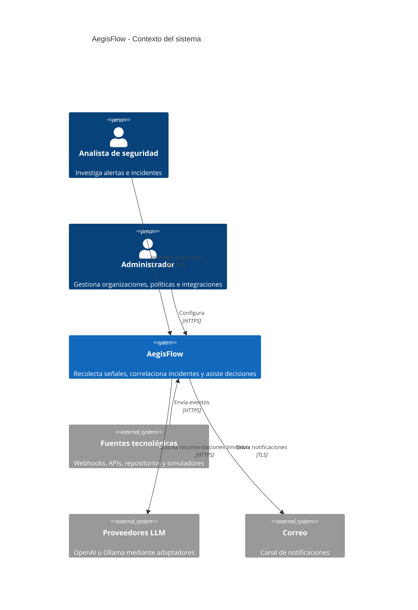
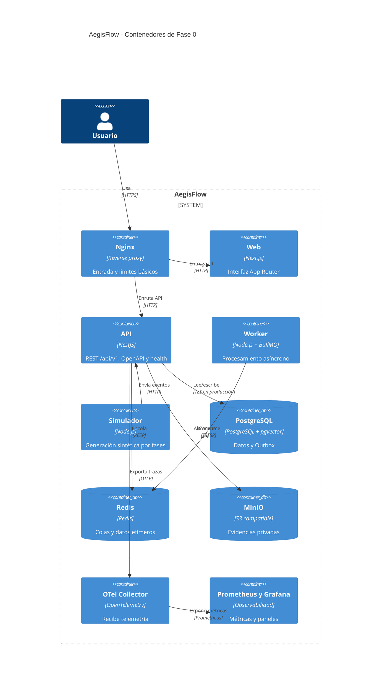

# Arquitectura C4

## Contexto

```mermaid
C4Context
  title AegisFlow - Contexto del sistema
  Person(analyst, "Analista de seguridad", "Investiga alertas e incidentes")
  Person(admin, "Administrador", "Gestiona organizaciones, políticas e integraciones")
  System(aegisflow, "AegisFlow", "Recolecta señales, correlaciona incidentes y asiste decisiones")
  System_Ext(sources, "Fuentes tecnológicas", "Webhooks, APIs, repositorios y simuladores")
  System_Ext(ai, "Proveedores LLM", "OpenAI u Ollama mediante adaptadores")
  System_Ext(mail, "Correo", "Canal de notificaciones")

  Rel(analyst, aegisflow, "Investiga y aprueba", "HTTPS")
  Rel(admin, aegisflow, "Configura", "HTTPS")
  Rel(sources, aegisflow, "Envía eventos", "HTTPS")
  Rel(aegisflow, ai, "Solicita recomendaciones limitadas", "HTTPS")
  Rel(aegisflow, mail, "Envía notificaciones", "TLS")
```

## Contenedores

```mermaid
C4Container
  title AegisFlow - Contenedores de Fase 0
  Person(user, "Usuario")
  System_Boundary(system, "AegisFlow") {
    Container(proxy, "Nginx", "Reverse proxy", "Entrada y límites básicos")
    Container(web, "Web", "Next.js", "Interfaz App Router")
    Container(api, "API", "NestJS", "REST /api/v1, OpenAPI y health")
    Container(worker, "Worker", "Node.js + BullMQ", "Procesamiento asíncrono")
    Container(simulator, "Simulador", "Node.js", "Generación sintética por fases")
    ContainerDb(postgres, "PostgreSQL", "PostgreSQL + pgvector", "Datos y Outbox")
    ContainerDb(redis, "Redis", "Redis", "Colas y datos efímeros")
    ContainerDb(minio, "MinIO", "S3 compatible", "Evidencias privadas")
    Container(otel, "OTel Collector", "OpenTelemetry", "Recibe telemetría")
    Container(observability, "Prometheus y Grafana", "Observabilidad", "Métricas y paneles")
  }

  Rel(user, proxy, "Usa", "HTTPS")
  Rel(proxy, web, "Entrega UI", "HTTP")
  Rel(proxy, api, "Enruta API", "HTTP")
  Rel(api, postgres, "Lee/escribe", "TLS en producción")
  Rel(api, redis, "Encola", "RESP")
  Rel(api, minio, "Almacena", "S3")
  Rel(worker, redis, "Consume", "RESP")
  Rel(simulator, api, "Envía eventos", "HTTP")
  Rel(api, otel, "Exporta trazas", "OTLP")
  Rel(otel, observability, "Expone métricas", "Prometheus")
```
