# Arquitectura de ingesta de eventos

```mermaid
flowchart LR
  Connector["Conector autenticado"] --> API["API: límites y validación"]
  API --> TX["Transacción: RawEvent cifrado + auditoría + outbox"]
  TX --> Dispatcher["Dispatcher con rol aegisflow_outbox"]
  Dispatcher --> Queue["BullMQ: aegisflow-ingestion"]
  Queue --> Worker["Worker bajo RLS del tenant"]
  Worker --> Policy["Adaptación + enmascaramiento"]
  Policy --> Normalized["NormalizedEvent"]
  Normalized --> Query["API cursor: eventos enmascarados"]
```

## Contratos internos

- `RawEvent`: sobre cifrado, hash, formato, conteo, estado, correlación y vencimiento. El contenido no
  sale de API/worker.
- `NormalizedEvent`: tipo, severidad, tiempo, activo opcional, hashes de actor/IP, mensaje y atributos
  enmascarados, fingerprint y versiones de esquema/máscara.
- `raw_event.received.v1`: sólo IDs de tenant, conector, raw event y correlación.
- `normalized_event.batch_created.v1`: IDs y número de registros; será consumido por detección en Fase 4.

## Estados y recuperación

`RECEIVED → PROCESSING → NORMALIZED` es la ruta normal. Una violación semántica termina en
`REJECTED`; fallos transitorios quedan en `FAILED` y BullMQ reintenta. El dispatcher reclama outbox con
`FOR UPDATE SKIP LOCKED`; eventos `PROCESSING` no confirmados vuelven a ser elegibles tras un minuto.
La restricción única por registro permite reanudar sin duplicar.

## Límites

- 1 MiB por solicitud, máximo 500 registros, profundidad 6 y 1.000 propiedades.
- Strings de atributos hasta 10.000 caracteres; mensajes normalizados hasta 2.000.
- Consultas con máximo 100 resultados y cursor opaco.
- Concurrencia del worker: 8 jobs. El diseño por lotes de hasta 500 filas evita una inserción por evento.
