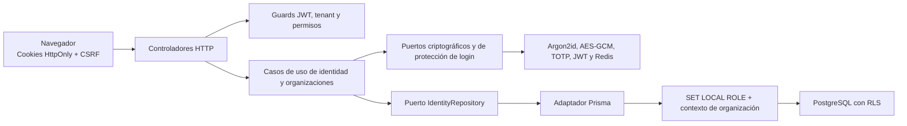

# Arquitectura de identidad y tenancy

## Fronteras

1. El navegador nunca recibe secretos persistentes. El secreto TOTP y los códigos de recuperación
   se muestran una única vez durante la activación.
2. El access token contiene una sola organización y un conjunto acotado de permisos. El guard ABAC
   rechaza otra organización antes de invocar un caso de uso.
3. Todo método del repositorio que toca datos organizacionales exige un `TenantContext`; no existe
   un valor por defecto.
4. El adaptador abre una transacción, reduce privilegios al rol `aegisflow_app` y fija el contexto
   antes de ejecutar Prisma. RLS rechaza filas de otro tenant aunque la consulta no tenga `where`.
5. Los eventos de seguridad conservan identificadores y metadatos mínimos; nunca contraseñas,
   cookies, OTP, secretos TOTP ni tokens.

## Permisos iniciales

| Permiso               | Uso                                                        |
| --------------------- | ---------------------------------------------------------- |
| `organization.read`   | Leer configuración básica de la organización activa        |
| `organization.manage` | Modificar configuración y crear organizaciones adicionales |
| `member.read`         | Consultar membresías                                       |
| `member.invite`       | Crear invitaciones de un solo uso                          |
| `member.manage`       | Cambiar asignaciones de rol                                |
| `role.read`           | Consultar roles y permisos                                 |
| `role.manage`         | Crear roles y definir permisos                             |
| `session.read`        | Consultar sesiones propias                                 |
| `session.revoke`      | Revocar sesiones propias                                   |
| `mfa.manage`          | Enrolar o regenerar MFA propio                             |

Cada organización crea roles de sistema `owner`, `admin`, `analyst` y `viewer`. Los roles de
sistema no se pueden renombrar ni eliminar. El rol `owner` recibe todos los permisos y los demás
usan el mínimo necesario para sus responsabilidades.
